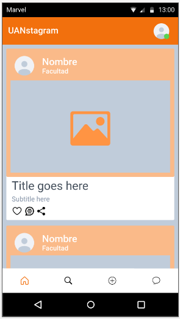
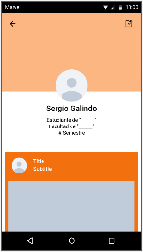
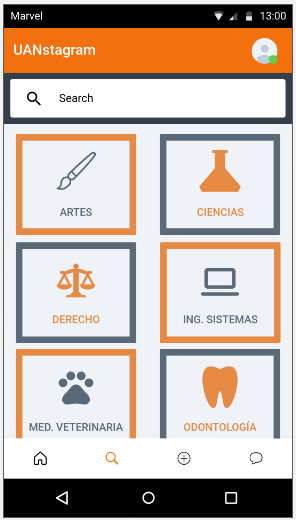
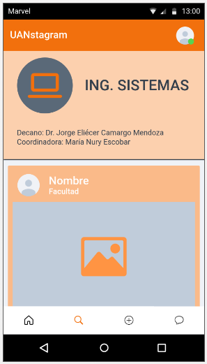

# Diseño de interfaz de usuario

La interfaz del usuario de UANstagram está inspirada en las interfaz de usuario de aplicaciones similares.

El diseño completo está disponible en [Marvel](https://marvelapp.com/prototype/a4d2ei1). 

La paleta de colores está basada en tonos naranjas y escala de grises.

El logo se encuentra en desarrollo.

Logo actual:

## Escenas principales
### 1. Inicio
El usuario apenas ingrese a la aplicación podrá encontrar la página principal en la cual se podrán visualizar todas las publicaciones que realicen los usuarios.

### 2. Perfil
En este apartado el usuario podrá editar ver su perfil a la vez que podrá editarlo, también podrá ver todas las publicaciones que ha realizado.

### 3. Página para subir multimedia
Al igual que plataformas similares, en este apartado 

### 4. Lista de Facultades

### 5. Chats

